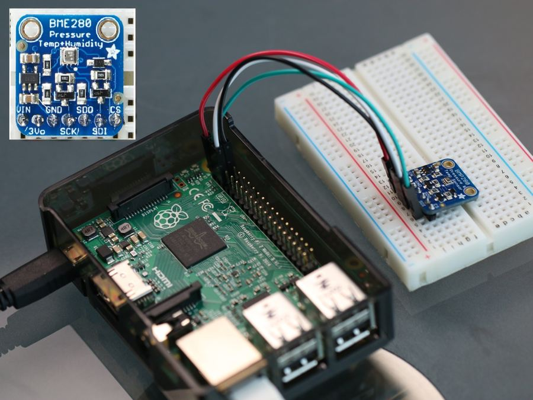
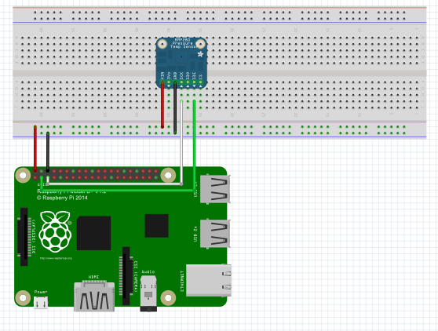

# Adafruit BME280 Weather Station

The full writeup and instructions for the [Weather Station V 3.0](https://www.hackster.io/23021/weather-station-v-3-0-b8b8bc) project can be found over at Hackster.io.

## Required Hardware

- [Raspberry Pi 2](https://www.raspberrypi.org/products/raspberry-pi-2-model-b/) or [3](https://www.raspberrypi.org/products/raspberry-pi-3-model-b/)
- [Adafruit BME280 I2C Temperature Humidity Pressure Sensor](https://www.adafruit.com/products/2652)
- Breadboard
- Male / Female Jumper Wires

## Required Software

- [Microsoft Windows 10 IoT Core](https://developer.microsoft.com/en-us/windows/iot/iotcore)
- [Microsoft Visual Studio](https://www.visualstudio.com)

## Dependencies

This project utilized the [BuildAzure.IoT.Adafruit.BME280](https://github.com/BuildAzure/BuildAzure.IoT.Adafruit.BME280) library and Nuget repository to communicate with the Adafruit BME280 Temperature, Humidity and Barometric Pressure Sensor from the Raspberry Pi.

## Wiring Diagram

## Attribution

This project is based on the [Weather Station V 2.0](https://www.hackster.io/windows-iot/weather-station-v-2-0-8abe16) project on Hackster.io.
